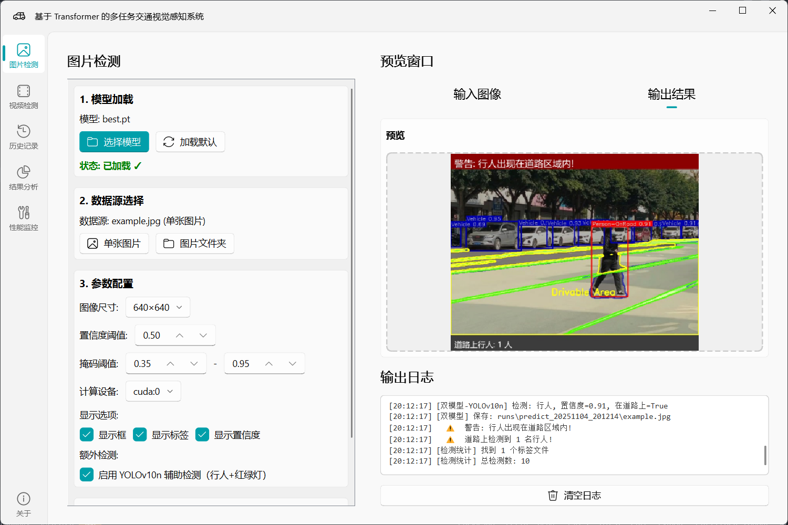

# 🚗 MTDETR-PyQt: 基于 Transformer 的多任务交通视觉感知系统

一个面向交通场景的多任务视觉系统，集成 Multi-task Transformer(MTDETR) 架构的 RMT-PPAD 与 实时目标检测模型 YOLOv10，通过现代化的 PyQt5 + PyQt-Fluent-Widgets 图形界面，提供图片/视频/批量文件的检测、实时预览、结果分析、性能监控与历史追溯等完整功能。



## 📑 目录

- [🚗 MTDETR-PyQt: 基于 Transformer 的多任务交通视觉感知系统](#-mtdetr-pyqt-基于-transformer-的多任务交通视觉感知系统)
  - [📑 目录](#-目录)
  - [✨ 特性概览](#-特性概览)
  - [📂 目录结构](#-目录结构)
  - [⚙️ 环境依赖](#️-环境依赖)
  - [📦 数据准备与预训练模型](#-数据准备与预训练模型)
  - [🚀 快速上手](#-快速上手)
  - [🤖 模型说明与类别](#-模型说明与类别)
  - [🗂️ 输出与默认路径](#️-输出与默认路径)
  - [🕘 历史记录与数据库](#-历史记录与数据库)
  - [📜 开源协议](#-开源协议)
  - [📚 参考资料](#-参考资料)

## ✨ 特性概览

- **多任务视觉感知**: 车辆目标检测、可行驶区域分割、车道线分割等场景元素感知。
- **双模型输出分析**: MTDETR 主模型预测 + YOLOv10 专项检测（行人/红绿灯），统一渲染与标签输出。
- **支持图片与视频**: 支持单张图片、图片文件夹、视频文件，提供视频实时预览、暂停/继续、录制、截图。

- **交通语义分析**: 行人上路风险预警、红绿灯颜色识别（红/黄/绿）。
- **历史记录与分析**: SQLite 存储预测历史；内置统计分析页生成图表与 HTML 报告。
- **性能监控**: CPU/GPU/内存/IO 实时指标与趋势图，适配 GPU 场景信息。

## 📂 目录结构

```text
./
├─ app_gui.py                  # 程序入口（高 DPI、主题设置、主窗体启动）
├─ config.py                   # 全局配置（路径、默认参数、设备检测、主题等）
├─ best.pt                     # MTDETR 权重
├─ yolov10n.pt                 # YOLOv10n 权重
├─ database/
│  └─ history.db               # 历史记录 SQLite 数据库
├─ dataset/
│  └─ example.jpg              # 示例图片
├─ gui_components/             # 界面模块
│  ├─ main_window.py           # 主窗体与侧边导航、模型共享
│  ├─ base_interface.py        # 图片/视频界面通用逻辑（加载、参数、预测、历史）
│  ├─ image_interface.py       # 图片/文件夹检测页（输入/输出预览、日志）
│  ├─ video_interface.py       # 视频检测+实时预览/录制/截图
│  ├─ predict_thread.py        # 异步推理线程，支持单/双模型与自定义保存
│  ├─ history_interface.py     # 历史记录列表、搜索、打开、删除/清空
│  ├─ analytics_interface.py   # 结果统计分析（类别分布、置信度、每图检测数、报告导出）
│  ├─ performance_interface.py # 性能监控（CPU/GPU/内存/IO/趋势图）
│  └─ about_interface.py       # 关于页（特性与技术栈）
├─ utils/                      # 工具模块
│  ├─ constants.py             # 统一类别与颜色、特殊 ID 映射
│  ├─ result_renderer.py       # 渲染（框/标签/多掩码、横幅）
│  ├─ traffic_analyzer.py      # 红绿灯颜色、可行驶区域分析
│  ├─ database.py              # 历史记录增删查与统计
│  ├─ performance_monitor.py   # 系统性能采集
│  ├─ formatting.py            # 时间/大小/置信度/路径等格式化
│  └─ ui_factory.py            # 常用 UI 组件工厂
├─ ultralytics/                # 本地化的 Ultralytics 模块
├─ runs/                       # 预测输出目录（图片、标签、视频、截图等）
├─ requirements.txt            # 依赖列表
├─ pyproject.toml              # 项目配置
└─ README.md                   # 说明文档
```

## ⚙️ 环境依赖

- Windows 10/11（推荐），也可在 Linux/macOS 运行（需替换中文字体路径）
- Python 3.10+（推荐）
- NVIDIA GPU + CUDA（可选，加速推理；CPU 模式亦可）

```
# 1) 创建与激活虚拟环境（推荐 Conda）
conda create -n mtdetr python=3.10.14 -y
conda activate mtdetr

# 2) 安装依赖
pip install torch==2.4.1 torchvision==0.19.1 torchaudio==2.4.1 --index-url https://download.pytorch.org/whl/cu124
pip install -r requirements.txt

# 3) 安装 ultralytics
cd ultralytics
python -m pip install -e .
```

## 📦 数据准备与预训练模型

- 数据准备：
    - 将待检测的图片/视频放入 `dataset/` 目录；支持常见图片（JPG/PNG/JPEG）与视频（MP4/AVI/MOV/MKV）格式。
    - 图片文件夹检测支持任意层级；建议结构如 `dataset/images/*.jpg`，便于管理与批量选择。
    - 提供示例 `dataset/example.jpg`，可用于首次运行验证。

- 预训练模型：
    - 主模型（MTDETR）：将权重命名为 `best.pt` 并放置于项目根目录，或在 `config.py` 修改 `DEFAULT_MODEL_PATH` 指向你的权重文件。下载：[MTDETR 权重](https://uwin365-my.sharepoint.com/:u:/g/personal/wang621_uwindsor_ca/EVvXPuqxXdRAkIuAVdth14gBYKuDJ6XqlA2ppRHsmeQN_w?e=hKcXJX)
    - 辅助模型（YOLOv10n）：将权重命名为 `yolov10n.pt` 并放置于项目根目录，或在 `config.py` 修改 `YOLOV10_MODEL_PATH`。下载：[yolov10n.pt](https://github.com/ultralytics/assets/releases/download/v8.3.0/yolov10n.pt)
    - 启动应用后，在“模型加载”卡片点击“加载默认”或“选择模型”完成载入。

## 🚀 快速上手

1) 📥 加载模型：
    - 点击“加载默认”载入主模型 `best.pt`（或“选择模型”指定自定义权重）。
    - 可勾选“启用 YOLOv10n 辅助检测（行人+红绿灯）”以融合检测结果。
2) 🗂️ 选择数据源：
    - 图片检测：单张图片或图片文件夹；右侧可切换“输入图像/输出结果”预览。
    - 视频检测：选择视频文件，可“启动预览/暂停/停止/录制/截图”。
3) 🎛️ 设置参数：
    - 图像尺寸、置信度阈值、掩码阈值、设备（自动检测 CPU/GPU）与显示选项。
4) ▶️ 开始检测：
    - 结果将保存至 `runs/predict_YYYYMMDD_HHMMSS/`，含图片与 `labels/*.txt`。
5) 📊 结果分析：
    - “结果分析”页可载入某次 `runs/...` 结果，查看类别分布/置信度/每图检测数并导出 HTML 报告。
6) 🕘 历史记录：
    - “历史记录”页展示最近预测（成功/失败、用时、数量），支持搜索、打开结果、删除与清空。
7) 📈 性能监控：
    - “性能监控”页查看 CPU/GPU/内存/IO 实时指标与历史趋势，便于调参与环境诊断。

## 🤖 模型说明与类别

- 主模型（MTDETR）：默认权重 `best.pt`，用于多任务感知（车辆、可驾驶区、车道线等）。
- 辅助模型（YOLOv10n）：`yolov10n.pt`，用于补充“行人/红绿灯”检测：内部将 YOLO 类别映射为统一的特殊 ID（见 `utils/constants.py`），与主模型结果合并渲染与导出。

## 🗂️ 输出与默认路径

- 图片/视频检测输出：`runs/predict_YYYYMMDD_HHMMSS/`
    - 结果图像（叠加分割掩码、检测框、标签、置信度与横幅提示）
    - 标签 `labels/*.txt`（YOLO: `class x y w h [confidence]`；行人/红绿灯使用统一特殊 ID）
- 实时预览录制：`runs/stream_YYYYMMDD_HHMMSS.mp4`（自动尝试多种编解码器）
- 截图：`runs/screenshot_YYYYMMDD_HHMMSS/`（含 `screenshot.jpg` 与对应标签）

## 🕘 历史记录与数据库

- SQLite 位于 `database/history.db`，表 `prediction_history` 字段包括：
    - `timestamp, model_path, source_path, source_type, result_path, parameters, success, error_message, inference_time, num_detections`
- “历史记录”页支持：查询、打开结果目录、删除单条、清空全部、统计汇总（总数/成功/失败/平均耗时）。

## 📜 开源协议

本项目采用 AGPL-3.0 许可证。详见 `LICENSE`。

## 📚 参考资料

- [Ultralytics](https://github.com/ultralytics/ultralytics)
- [RMT-PPAD](https://github.com/JiayuanWang-JW/RMT-PPAD)
- [PyQt-Fluent-Widgets](https://github.com/zhiyiYo/PyQt-Fluent-Widgets)